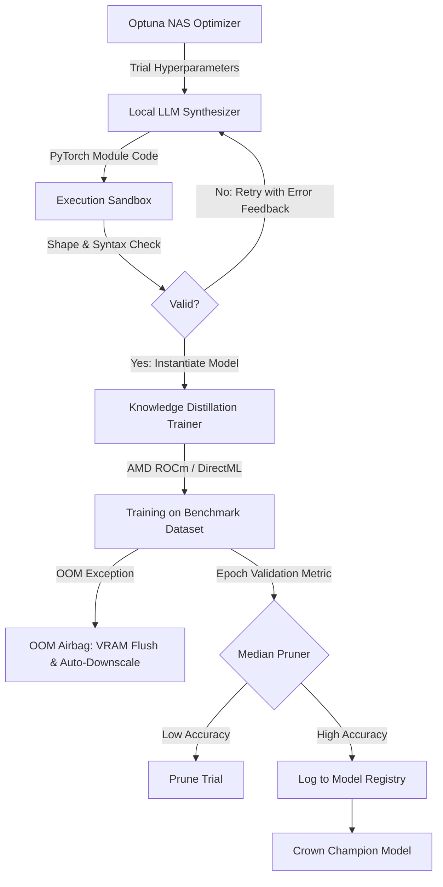

# ⚡ AI Builder — Autonomous Neural Architecture Search (NAS) Studio (AMD Edition)

[](https://www.python.org/downloads/)
[](https://pytorch.org/)
[](https://rocm.docs.amd.com/)
[](https://github.com/microsoft/DirectML)
[](https://streamlit.io/)
[](LICENSE)

**AI Builder** is an autonomous Neural Architecture Search (NAS) and deep learning discovery platform engineered strictly and exclusively for **AMD Radeon GPUs (ROCm & DirectML)** with **CPU fallback**. It seamlessly orchestrates **Local LLM Code Generation** (via Ollama), **Bayesian Hyperparameter Optimization** (via Optuna TPE & ASHA Pruning), **ResNet Knowledge Distillation**, and **AMD Hardware Acceleration**.

---

## 🔴 Pure AMD Hardware Acceleration (ROCm & DirectML)

AI Builder is specifically engineered, tuned, and benchmarked for AMD Radeon hardware (e.g. AMD Radeon RX 7600 XT, 7700 XT, 7800 XT, 7900 XT/XTX, RX 6000 series):

- **🐧 Linux / WSL2 — Native AMD ROCm**:
  - Run PyTorch with native AMD ROCm / HIP kernel execution.
  - Install ROCm wheels:
    ```bash
    pip install torch torchvision --index-url https://download.pytorch.org/whl/rocm6.1
    ```
- **🪟 Windows — Direct3D 12 Compute (DirectML)**:
  - Run high-throughput GPU training on Windows using Microsoft DirectML with zero driver hassle:
    ```bash
    pip install torch-directml
    ```
- **🛡️ DirectML OOM Airbag Crash Protection**:
  - Automatically intercepts DirectML VRAM allocation limits, purges GPU caches, penalizes model complexity parameters, and auto-downscales architecture channels so your NAS loop runs uninterrupted.
- **🎮 Live AMD Adrenalin Telemetry**:
  - Press `Ctrl + Shift + O` on Windows to activate the AMD Adrenalin live VRAM, power, and clock overlay during training.

---

## 🌟 Key Features

1. **🤖 Local LLM Architectural Synthesis**:
   - Synthesizes deep convolutional and residual neural network architectures on-the-fly using local LLMs (`qwen2.5-coder:7b`, `llama3`, `deepseek-coder`, etc.).
   - Sandboxed dynamic module verification: validates tensor shapes, parameter counts, and gradient flow before training.

2. **🔬 Optuna Bayesian Architecture Search**:
   - Automated Tree-structured Parzen Estimator (TPE) search over convolutional depth, base channel multipliers, FC layer units, activation functions (`GELU`, `ReLU`), dropout rates, and learning rates.
   - **ASHA / Median Pruning**: Early-terminates underperforming candidate trials to preserve AMD GPU compute.

3. **🎓 Knowledge Distillation Engine**:
   - Transfers representations from high-capacity frozen ResNet teacher networks to compact student candidates.
   - Computes weighted Kullback-Leibler (KL) divergence distillation loss alongside standard cross-entropy task loss.

4. **📊 Interactive Streamlit Discovery Studio**:
   - **Live NAS Stream**: Real-time progress monitoring, trial parameters, and live PyTorch code inspection.
   - **Knowledge Distillation Studio**: Standalone slider controls for distillation temperature, alpha weights, and learning rate schedules.
   - **Freeform Prompt & Sandbox Editor**: Interactive code editor and prompt box for synthesizing custom architectures.
   - **Hall of Fame**: Persistent registry of discovered Pareto-optimal models with 1-click Python script and weight downloads.

5. **👑 Automated Champion Selection**:
   - Automatically crowns the best-performing architecture across trials and exports standalone deployable weights (`wonderland_champion.pt`) and code (`wonderland_champion.py`).

---

## 🏗️ Architecture Flow



---

## 📁 Repository Structure

```text
AI_Builder/
├── ai_builder/                 # Core AI Builder Package
│   ├── backend/
│   │   ├── hardware.py         # AMD ROCm, DirectML & CPU device resolver
│   │   └── telemetry.py        # Real-time AMD VRAM and system memory tracker
│   ├── evolution/
│   │   ├── bayesian_search.py  # Optuna Bayesian NAS search space definitions
│   │   ├── fitness.py          # Multi-objective fitness scoring functions
│   │   ├── lineage.py          # Model architecture lineage & mutation graph
│   │   └── registry.py         # Discovered model catalog & persistent registry
│   ├── inventor/
│   │   ├── code_synthesizer.py # Local LLM code generator & system prompt engine
│   │   ├── llm_architect.py    # Topology generator & architectural primitives
│   │   ├── primitives.py       # Custom layers: ResBlock, LiquidMemoryGate, etc.
│   │   └── topology.py         # Computational graph representations
│   ├── training/
│   │   ├── benchmarks.py       # Synthetic and standard CV benchmark loaders
│   │   ├── datasets.py         # FashionMNIST & CIFAR-10 data loaders
│   │   ├── distillation.py     # Teacher-student knowledge distillation loss
│   │   ├── metrics.py          # Precision, Recall, F1, and confusion matrix
│   │   ├── sandbox.py          # Safe dynamic module compilation & validation
│   │   └── trainer.py          # AMD DirectML / ROCm training loop with gradient clipping
│   └── ui/
│       ├── app.py              # Main interactive Streamlit application
│       └── __init__.py
├── tests/
│   └── test_ai_builder.py      # Full technical verification test suite
├── launch_builder.bat          # 1-Click Windows Studio launcher
├── main.py                     # Master NAS orchestrator CLI
├── nas_engine.py               # High-Precision locked NAS CLI (92.58%+ config)
├── requirements.txt            # Project dependencies
├── .gitignore                  # Git ignore rules
└── LICENSE                     # MIT License
```

---

## 🚀 Quickstart

### 1. Prerequisites

- Python 3.10, 3.11, or 3.12
- [Ollama](https://ollama.ai/) installed and running locally:
  ```bash
  ollama pull qwen2.5-coder:7b
  ```

### 2. Installation

```bash
git clone https://github.com/your-username/AI_Builder.git
cd AI_Builder
pip install -r requirements.txt
```

#### AMD Hardware Setup:
- **AMD Radeon (Windows Direct3D 12 Compute)**:
  ```bash
  pip install torch-directml
  ```
- **AMD Radeon (Linux/WSL ROCm)**:
  ```bash
  pip install torch torchvision --index-url https://download.pytorch.org/whl/rocm6.1
  ```

### 3. Launching the Interactive Studio

Double-click `launch_builder.bat` (Windows) or run:
```bash
streamlit run ai_builder/ui/app.py
```

### 4. Running Headless NAS via Command Line

**Run Standard Search (Optuna TPE):**
```bash
python main.py --trials 10 --epochs 5 --task fashionmnist --llm qwen2.5-coder:7b
```

**Run High-Precision Locked Search (92.58%+ Configuration):**
```bash
python nas_engine.py --trials 15 --epochs 12 --task fashionmnist
```

---

## 🧪 Running Unit Tests

To run the full automated verification test suite:
```bash
python tests/test_ai_builder.py
```

---

## 📜 License

This project is licensed under the [MIT License](LICENSE).
